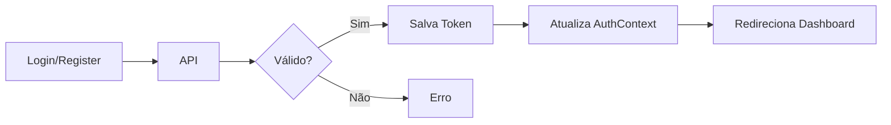

# 📚 Documentação Completa - Sistema Desbravadores

## 📖 Índice

1. [Visão Geral](#visão-geral)
2. [Arquitetura](#arquitetura)
3. [Autenticação](#autenticação)
4. [Roles e Permissões](#roles-e-permissões)
5. [Páginas e Componentes](#páginas-e-componentes)
6. [API Integration](#api-integration)
7. [Instalação e Configuração](#instalação-e-configuração)
8. [Troubleshooting](#troubleshooting)

---

## 🎯 Visão Geral

Sistema completo de gestão para clubes de Desbravadores, com:
- Autenticação e controle de acesso (RBAC)
- Dashboard administrativo com analytics
- Dashboard de membro estilo rede social
- Gestão de membros, eventos, finanças e inventário
- Feed social com posts e interações

---

## 🏗️ Arquitetura

### Stack Tecnológico

```
Frontend:
- React 18 + TypeScript
- Vite 7
- React Router v7
- Lucide Icons
- Recharts (gráficos)
- TailwindCSS

Backend (esperado):
- Node.js / Express (ou similar)
- JWT Authentication
- REST API
- PostgreSQL / MySQL
```

### Estrutura de Pastas

```
src/
├── components/
│   ├── auth/             # Login, Register, RoleGuard
│   ├── dashboard/        # Componentes do dashboard admin
│   ├── layout/           # MainLayout, Sidebar, Header
│   └── ui/               # Componentes reutilizáveis
├── contexts/
│   └── AuthContext.tsx   # Gerenciamento global de autenticação
├── hooks/
│   ├── useAuth.ts
│   ├── useMembers.ts
│   ├── useEvents.ts
│   ├── useFinance.ts
│   └── useInventory.ts
├── pages/
│   ├── auth/             # Páginas de autenticação
│   ├── dashboard/        # Dashboard administrativo
│   ├── member/           # Dashboard do membro (social)
│   ├── members/          # Gestão de membros
│   ├── events/           # Gestão de eventos
│   ├── finance/          # Gestão financeira
│   └── inventory/        # Gestão de inventário
├── services/
│   └── api.ts            # Cliente HTTP centralizado
├── types/
│   └── index.ts          # TypeScript interfaces
└── utils/
    ├── constants.ts      # Constantes globais
    ├── roles.ts          # RBAC helpers
    ├── validators.ts     # Validações
    └── formatters.ts     # Formatadores de dados
```

---

## 🔐 Autenticação

### Endpoints

#### Login
```http
POST /auth/login
Content-Type: application/json

{
  "email": "user@example.com",
  "password": "senha123"
}

Response 200:
{
  "access_token": "eyJhbG...",
  "token_type": "Bearer",
  "expires_in": 3600,
  "user": {
    "id": 1,
    "name": "João Silva",
    "email": "user@example.com",
    "role": "USER"
  }
}
```

#### Registro
```http
POST /auth/register
Content-Type: application/json

{
  "name": "João Silva",
  "email": "joao@example.com",
  "password": "senha123",
  "confirmPassword": "senha123"
}

Response 201: (mesmo formato do login)
```

### Fluxo de Autenticação



### Proteção de Rotas

```typescript
// Rota protegida básica
<Route path="/" element={
  <ProtectedRoute>
    <DashboardPage />
  </ProtectedRoute>
} />

// Rota com controle de role
<Route path="/finance" element={
  <ProtectedRoute>
    <RoleGuard allowedRoles={["ADMIN", "DIRECTOR"]}>
      <FinancePage />
    </RoleGuard>
  </ProtectedRoute>
} />
```

Documentação completa: [AUTHENTICATION.md](./AUTHENTICATION.md)

---

## 👥 Roles e Permissões

### Roles Disponíveis

| Role | Descrição | Acesso |
|------|-----------|--------|
| `ADMIN` | Administrador do sistema | Total |
| `DIRECTOR` | Diretor do clube | Quase total (exceto gestão de usuários) |
| `LEADER` | Líder de unidade | Limitado (eventos, membros de sua unidade) |
| `USER` | Usuário padrão | Apenas visualização |
| `MEMBER` | Membro do clube | Dashboard social, eventos |

### Grupos de Roles

```typescript
// src/utils/roles.ts
export const ADMIN_ROLES: AppRole[] = ['ADMIN', 'DIRECTOR'];
export const STAFF_ROLES: AppRole[] = ['LEADER', ...ADMIN_ROLES];
```

### Helpers de Permissão

```typescript
import { isAdmin, hasAnyRole } from '@/utils/roles';

// Verifica se é admin
if (isAdmin(user.role)) {
  // Mostrar opção administrativa
}

// Verifica múltiplas roles
if (hasAnyRole(user.role, ['ADMIN', 'DIRECTOR', 'LEADER'])) {
  // Permitir edição
}
```

### Visibilidade no Sidebar

```typescript
// Menu items com controle de acesso
const menuItems: MenuItem[] = [
  { id: 'dashboard', icon: Home, label: 'Dashboard' },
  { id: 'members', icon: Users, label: 'Membros' },
  { 
    id: 'finance', 
    icon: DollarSign, 
    label: 'Finanças', 
    allowedRoles: ['ADMIN', 'DIRECTOR'] // Só admins veem
  },
];
```

---

## 📱 Páginas e Componentes

### Dashboard Administrativo (`/`)

**Quando:** Usuário com role `ADMIN` ou `DIRECTOR`

**Features:**
- Cards de estatísticas (membros, eventos, finanças, inventário)
- Gráfico de receitas vs despesas
- Gráfico de membros por unidade
- Distribuição de eventos (pizza chart)
- Atividades recentes
- Cards de resumo financeiro

**Componente:** `src/pages/dashboard/DashboardPage.tsx`

### Dashboard do Membro (`/`)

**Quando:** Usuário com role `USER` ou `MEMBER`

**Features:**
- **Coluna Esquerda:**
  - Card de perfil com progresso de classe
  - Estatísticas de presenças (streak 🔥)
  - Empréstimos ativos
  
- **Coluna Central:**
  - Próximos eventos com confirmação
  - Mensalidades (status: pago/pendente/atrasado)
  - Criar post no feed
  - Feed social com curtidas e comentários

**Componente:** `src/pages/member/MemberDashboard.tsx`

**Design:** Estilo rede social moderna (Instagram/Facebook)

### Gestão de Membros (`/members`)

**Acesso:** Todos usuários autenticados (visualização)  
**Edição:** `ADMIN`, `DIRECTOR`, `LEADER`

**Features:**
- Listagem com busca e filtros
- Criação de novos membros
- Edição de dados
- Visualização de detalhes
- Exclusão (soft delete)

**Campos:**
- Dados pessoais (nome, nascimento, gênero)
- Dados dos pais/responsáveis
- Contato de emergência
- Unidade (Lobinhos, Desbravadores, etc)
- Status (ativo/inativo)

### Gestão de Eventos (`/events`)

**Acesso:** Todos autenticados  
**Criação/Edição:** `ADMIN`, `DIRECTOR`, `LEADER`

**Features:**
- Calendário de eventos
- Criação com detalhes (data, local, custo)
- Gestão de participantes
- Status (agendado, em andamento, concluído, cancelado)
- Controle de vagas

### Gestão Financeira (`/finance`)

**Acesso:** Apenas `ADMIN` e `DIRECTOR`

**Tabs:**
1. **Visão Geral:** Cards de receita, despesa, saldo
2. **Transações:** Lista com criação/edição
3. **Categorias:** Gestão de categorias
4. **Contas:** Gestão de contas bancárias
5. **Mensalidades:** Controle de pagamentos de membros
6. **Relatórios:** Gráficos e exportações

### Gestão de Inventário (`/inventory`)

**Acesso:** Apenas `ADMIN` e `DIRECTOR`

**Features:**
- Lista de itens com busca
- Criação com categorias
- Controle de quantidade mínima
- Alertas de estoque baixo
- Localização física
- Código de barras
- Empréstimos (item + membro + prazo)

---

## 🔌 API Integration

### Cliente HTTP

**Localização:** `src/services/api.ts`

**Features:**
- Interceptor de token automático
- Logs debug (VITE_DEBUG_API=true)
- Tratamento de erros padronizado
- Tipagem TypeScript completa

**Exemplo de Uso:**

```typescript
import { apiService } from '@/services/api';

// Login
const response = await apiService.login(email, password);

// Buscar membros
const members = await apiService.getMembers();

// Criar evento
const event = await apiService.createEvent({
  title: 'Acampamento',
  startDate: '2025-02-15',
  location: 'Parque Nacional'
});
```

### Hooks Customizados

#### useMembers
```typescript
const { members, isLoading, error, createMember, updateMember, deleteMember } = useMembers();
```

#### useEvents
```typescript
const { events, isLoading, error, createEvent, updateEvent, deleteEvent } = useEvents();
```

#### useFinance
```typescript
const { 
  dashboard, 
  transactions, 
  categories, 
  accounts,
  createTransaction,
  isLoading 
} = useFinance();
```

#### useInventory
```typescript
const { 
  items, 
  categories, 
  loans,
  createItem,
  createLoan,
  isLoading 
} = useInventory();
```

### Error Handling

```typescript
// Em todos os hooks
try {
  await createMember(data);
  setSuccess('Membro criado com sucesso!');
} catch (err: any) {
  setError(err.message || 'Erro ao criar membro');
}
```

**Mensagens Contextuais:**
- 400/422: Detalhes de validação do backend
- 401: "Credenciais inválidas" (limpa token)
- 403: "Acesso negado"
- 404: "Rota não encontrada: [URL]"
- 500+: "Erro no servidor: [detalhes]"
- Network: "Não foi possível conectar ao servidor"

---

## ⚙️ Instalação e Configuração

### Pré-requisitos

- Node.js 18+
- pnpm (ou npm/yarn)
- Backend rodando em `http://localhost:3000` (ou configurado)

### Instalação

```bash
# Clone o repositório
git clone https://github.com/pedroCapitango/Dbv-mananger-front.git
cd Dbv-mananger-front

# Instale dependências
pnpm install

# Configure variáveis de ambiente
cp .env.example .env
```

### Variáveis de Ambiente

```bash
# .env
VITE_API_BASE_URL=http://localhost:3000/api/v1
VITE_ENABLE_DEV_MODE=false
VITE_DEBUG_API=true
```

**Descrição:**
- `VITE_API_BASE_URL`: URL base da API backend
- `VITE_ENABLE_DEV_MODE`: Habilita mocks (apenas dev)
- `VITE_DEBUG_API`: Logs verbosos de requisições

### Desenvolvimento

```bash
# Inicia servidor de desenvolvimento
pnpm dev

# Acesse: http://localhost:5173
```

### Build para Produção

```bash
# Build otimizado
pnpm build

# Preview do build
pnpm preview
```

### Lint e Type Check

```bash
# Verificar TypeScript
pnpm tsc --noEmit

# Lint (se configurado)
pnpm lint
```

---

## 🔧 Troubleshooting

### Problema: CORS Error

**Sintoma:** `Access to fetch at '...' from origin '...' has been blocked by CORS policy`

**Solução:**

Backend deve incluir headers CORS:

```javascript
// Express example
app.use(cors({
  origin: 'http://localhost:5173',
  credentials: true
}));
```

---

### Problema: 404 Not Found em todas as rotas

**Sintoma:** Todas chamadas para `/auth/login`, `/members` etc retornam 404

**Causas:**
1. Backend não está rodando
2. URL base incorreta no `.env`
3. Backend não possui as rotas implementadas

**Verificações:**

```bash
# Teste se backend está online
curl http://localhost:3000/api/v1/auth/login

# Verifique VITE_API_BASE_URL no .env
echo $VITE_API_BASE_URL
```

---

### Problema: Token não persiste após refresh

**Sintoma:** Ao recarregar página, usuário é deslogado

**Solução:**

1. Verificar se `localStorage.setItem('auth_token', ...)` está sendo chamado
2. Verificar se `AuthContext` lê o token no `useEffect` inicial:

```typescript
useEffect(() => {
  const token = localStorage.getItem('auth_token');
  if (token) {
    apiService.setToken(token);
    // Opcional: validar token com backend
  }
}, []);
```

---

### Problema: Sidebar não filtra por role

**Sintoma:** Membros normais veem "Finanças" e "Inventário"

**Verificação:**

1. Certifique-se que `user.role` está sendo retornado corretamente do backend
2. Verifique se `allowedRoles` está definido nos menu items:

```typescript
{ 
  id: 'finance', 
  icon: DollarSign, 
  label: 'Finanças', 
  allowedRoles: ['ADMIN', 'DIRECTOR'] 
}
```

3. Confirme que `Sidebar.tsx` está filtrando:

```typescript
const visibleItems = menuItems.filter((item) => {
  if (!item.allowedRoles) return true;
  return hasAnyRole(user?.role, item.allowedRoles);
});
```

---

### Problema: Erro de validação genérico

**Sintoma:** "Falha de validação" sem detalhes

**Debug:**

Habilite debug da API:

```bash
# .env
VITE_DEBUG_API=true
```

Verifique console do navegador para ver:
- Request body enviado
- Response do backend
- Mensagens de erro detalhadas

---

### Problema: Build falha com TypeScript errors

**Sintomas comuns:**
- "Property X does not exist on type Y"
- "Argument of type X is not assignable to parameter of type Y"

**Soluções:**

1. Rode type check:
```bash
pnpm tsc --noEmit
```

2. Verifique se todos os tipos estão importados corretamente
3. Use `any` temporariamente para identificar problema (não commitar):
```typescript
const data: any = await apiService.getMembers();
```

4. Certifique-se que `src/types/index.ts` exporta todas interfaces necessárias

---

### Problema: Double fetch em React 18 StrictMode

**Sintoma:** Hooks fazem 2 requisições idênticas no dev

**Causa:** React 18 StrictMode monta componentes 2x em desenvolvimento

**Solução:** Já implementado nos hooks com `didInit` ref:

```typescript
const didInit = useRef(false);

useEffect(() => {
  if (didInit.current) return;
  didInit.current = true;
  
  fetchMembers();
}, []);
```

---

### Problema: Senha fraca aceita no frontend mas rejeitada no backend

**Causa:** Validações do frontend e backend não estão alinhadas

**Solução:**

Alinhe regras:

```typescript
// Frontend
if (password.length < 8) {
  errors.password = 'Senha deve ter pelo menos 8 caracteres';
}

// Backend deve validar o mesmo
```

---

## 📊 Próximas Features Planejadas

### Fase 1 - Integração Backend
- [ ] Conectar todos hooks com endpoints reais
- [ ] Implementar paginação nos listings
- [ ] Cache de requisições (React Query)
- [ ] Otimistic updates

### Fase 2 - UX/UI
- [ ] Modo escuro
- [ ] Notificações em tempo real (WebSocket)
- [ ] Upload de imagens (avatar, posts)
- [ ] Editor WYSIWYG para posts
- [ ] Filtros avançados em listings

### Fase 3 - Features Sociais
- [ ] Sistema de comentários completo
- [ ] Reações múltiplas (👏, 🎉, ❤️)
- [ ] Compartilhamento de posts
- [ ] Chat entre membros
- [ ] Notificações push

### Fase 4 - Mobile
- [ ] Progressive Web App (PWA)
- [ ] App nativo (React Native)
- [ ] Geolocalização para eventos
- [ ] QR Code check-in

---

## 🤝 Contribuindo

### Padrões de Código

1. **TypeScript:** Sempre tipar props e estados
2. **Components:** PascalCase, functional components
3. **Hooks:** prefixo `use`, camelCase
4. **Files:** PascalCase para componentes, camelCase para utils
5. **CSS:** TailwindCSS, evitar CSS inline

### Commits

Seguir Conventional Commits:

```bash
feat: adiciona funcionalidade de registro
fix: corrige validação de email
docs: atualiza README com instruções de deploy
refactor: reorganiza estrutura de pastas
style: formata código com prettier
test: adiciona testes para AuthContext
```

### Pull Requests

1. Fork do repositório
2. Crie branch: `git checkout -b feature/minha-feature`
3. Commit: `git commit -m 'feat: adiciona minha feature'`
4. Push: `git push origin feature/minha-feature`
5. Abra PR no GitHub

---

## 📞 Suporte

- **Issues:** [GitHub Issues](https://github.com/pedroCapitango/Dbv-mananger-front/issues)
- **Email:** suporte@desbravadores.ao (exemplo)
- **Documentação:** `/docs` neste repositório

---

## 📄 Licença

Este projeto é privado e proprietário. Todos os direitos reservados.

---

**Versão:** 1.0.0  
**Última Atualização:** Janeiro 2025  
**Mantenedor:** Pedro Capitango
